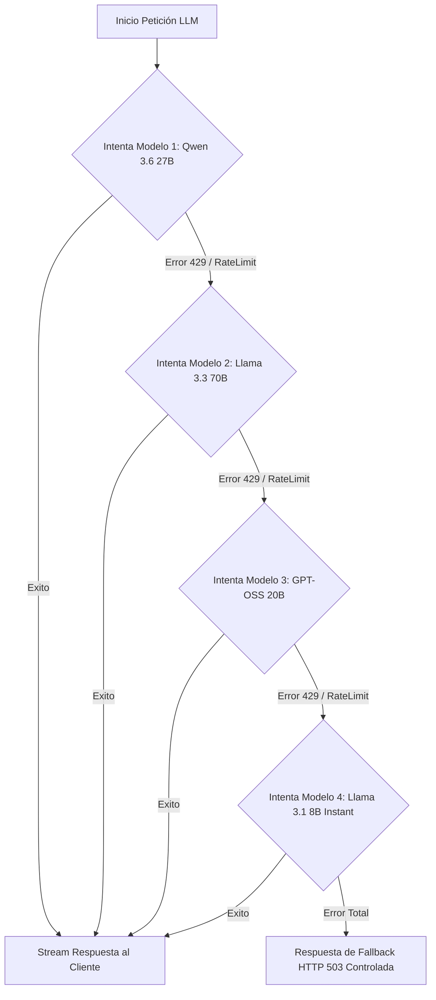

# 🏛️ DOCUMENTO DE ARQUITECTURA DE SOFTWARE: BANORTE GENAI COPILOT

## 1. Visión General del Sistema

**Banorte GenAI Copilot** es una plataforma web full-stack bancaria potenciada por Inteligencia Artificial Agéntica y RAG (Retrieval-Augmented Generation). Permite a los usuarios autenticados interactuar de forma conversacional con su cuenta bancaria (consultar saldos, movimientos, simular créditos, realizar transferencias de dinero reales) e indagar sobre normativas, productos e información institucional de Banorte mediante procesamiento de documentos PDF.

```
[ 1. CLIENTE FRONTEND (React) ]
      │  (Petición HTTP / Streaming SSE / Archivos PDF y Audio)
      ▼
[ 2. SERVIDOR API (FastAPI en main.py) ]
      │  ├── Valida Auth (Token JWT con Supabase)
      │  ├── Mide Métricas (Prometheus: TTFT, Latencia)
      │  └── Prepara Cadena de Modelos (Groq Fallback)
      ▼
[ 3. ORQUESTADOR DE IA (LangGraph ReAct) ]
      │
      ├───> ¿Es consulta sobre documentos o normativa Banorte?
      │     └──> [ 4A. VECTOR STORE (Qdrant) ] ➔ Busca información semántica en PDFs
      │
      ├───> ¿Es operación bancaria (saldo, transferencia, préstamos)?
      │     └──> [ 4B. BASE DE DATOS (Supabase PostgreSQL) ] ➔ Ejecuta SQL seguro
      │
      └───> [ 4C. MODELO DE LENGUAJE (Groq Cloud LLM) ] ➔ Procesa prompt y genera respuesta
```

---

## 2. Tecnologías y Fundamento Técnico

| Componente | Tecnología | Fundamento Técnico y Selección |
| :--- | :--- | :--- |
| **Frontend** | React (Vite) + Tailwind / CSS | Interfaz cliente reactiva optimizada para web y móvil. Implementa Server-Sent Events (SSE) para renderizar texto streaming en tiempo real y componentes modales para citas de RAG. |
| **API Framework** | FastAPI (Python 3.11+) | Asincronía nativa (`asyncio`), validación de esquemas con Pydantic, baja latencia y alta concurrencia. Exposición de SSE streams con `StreamingResponse`. |
| **Orquestación IA** | LangGraph (LangChain) | Modelo agéntico ReAct (Reasoning + Acting). Permite ejecutar bucles de decisión cíclicos donde la LLM decide si responder directamente o invocar herramientas con retorno de estado. |
| **Proveedor LLM** | Groq Cloud API | Inferencia ultrarrápida usando LPU (Language Processing Units). Proporciona una velocidad extremadamente alta (ideal para tiempo real) e inferencia con modelos como Llama 3.3 70B y Qwen 2.5 72B. |
| **Resiliencia LLM** | Groq Model Fallback Chain | Estrategia de recuperación ante errores HTTP 429 (Rate Limit / Quota) o 500. Ante una falla, el sistema conmuta automáticamente a modelos alternativos en secuencia sin interrumpir al usuario. |
| **Vector DB (RAG)** | Qdrant + FastEmbed | Base de datos vectorial ligera y optimizada. Almacena fragmentos (chunks) de PDFs institucionales codificados vectorialmente mediante `FastEmbed` (ONNX / BGE embeddings). |
| **Base de Datos Core** | Supabase (PostgreSQL) | Almacena perfiles de usuarios, cuentas bancarias, saldos, contactos y libro de transacciones financieras con integridad ACID. |
| **Autenticación** | Supabase Auth (JWT) | Emisión de tokens criptográficos JWT Bearer. Permite autenticar cada petición HTTP y extraer el `profile_id` de forma infalsificable. |
| **Audio Transcriber** | Groq Whisper v3 | Procesamiento de blobs de audio (`multipart/form-data`) desde el navegador para transcripción instantánea a texto mediante modelos Whisper. |
| **Observabilidad** | Prometheus + SQLite Audit | Colección de métricas clave (TTFT - Time to First Token, latencia total, tokens generados, errores por modelo) expuestas en `/metrics` y tablas SQLite auditadas. |

---

## 3. Orquestación del Agente de IA (LangGraph ReAct Pipeline)

La inteligencia conversacional opera en un ciclo de razonamiento agéntico (ReAct) estructurado en LangGraph:

### Paso a Paso: Flujo de Ejecución ReAct en una Petición Real

Para entender cómo funciona el agente ante una orden del usuario (ejemplo: *"Transfiere $500 a la cuenta de Renta"*):

1. **Paso 1 - Autenticación y Carga de Contexto (FastAPI + Supabase):**
   * El cliente envía la solicitud con el Token JWT del usuario.
   * El servidor extrae e identifica al usuario autenticado (`user_id`).
   * Se recupera el historial conversacional previo para no perder el hilo.

2. **Paso 2 - Inicialización del Agente Segregado (LangGraph):**
   * Se instancian las herramientas vinculadas exclusivamente a ese `user_id` (impidiendo que opere cuentas ajenas).
   * Se envía el System Prompt bancario y la consulta al modelo LLM.

3. **Paso 3 - Ciclo ReAct (Razonamiento + Acción):**
   * **Razonamiento (Thought):** El LLM deduce: *"Para transferir dinero, necesito ejecutar la función `herramienta_transferir_dinero` con monto=500 y destino='Renta'"*.
   * **Acción (Action):** LangGraph detiene momentáneamente la generación de texto y ejecuta la función Python correspondiente.
   * **Respuesta de la Herramienta (Observation):** La función ejecuta una transacción SQL en **Supabase** (debita la cuenta origen e incrementa la destino) y devuelve: `"Transferencia realizada exitosamente. Saldo restante: $9,500"`.

4. **Paso 4 - Generación de Respuesta y Registro (Streaming + Observabilidad):**
   * El LLM recibe la confirmación de la herramienta y redacta la respuesta amigable al usuario.
   * La respuesta se transmite token por token al Frontend mediante Server-Sent Events (SSE).
   * En segundo plano, se registran las métricas (latencia, tokens consumidos) y el log de auditoría en SQLite.

---

## 4. Descripción del Dominio y Capacidades del Sistema

### A. Capacidades Bancarias (Core Financial Operations)
* **Consulta de Saldo en Tiempo Real:** Acceso directo a la cuenta vinculada al usuario autenticado.
* **Transferencias Bancarias Seguras:** Transacciones inmediatas entre usuarios registrando débitos, créditos e historial en la base de datos Supabase.
* **Simulación de Créditos/Préstamos:** Cálculo matemático automático de cuotas, tasas de interés y esquemas de pago (Francés/Alemán).
* **Historial de Movimientos:** Acceso a los últimos estados de cuenta y transacciones auditadas.

### B. Capacidades RAG (Retrieval-Augmented Generation)
* **Ingestión Dinámica de Documentos:** Ingesta de archivos PDF institucionales (Manuales, Políticas Banorte, Tarifarios) divididos en fragmentos con superposición (chunking).
* **Búsqueda Semántica:** Vectorización de consultas mediante embeddings locales y búsqueda por distancia coseno en **Qdrant**.
* **Visualización de Citas:** El sistema entrega los fragmentos exactos de origen al frontend para que el usuario pueda auditar el documento y página de donde el agente extrajo la información.

### C. Capacidades Multimodal (Voz a Texto)
* **Entrada de Voz:** Grabación mediante la Web Audio API del navegador, envío del blob `.webm`/`.mp3` al backend y transcripción ultra-rápida utilizando el modelo Whisper v3 en Groq.

### D. Seguridad e Inyección Contenida (User Isolation)
Para evitar vulnerabilidades de inyección o suplantación de identidad (donde el usuario pida *"Transfiere dinero desde la cuenta de otro usuario"*):
* El agente **NO** recibe el `user_id` desde el modelo LLM ni desde los argumentos de la tool.
* La función `get_agent_tools_for_user(user_id)` genera clausuras (*closures*) Python donde el `user_id` está fijado internamente y extraído directamente del JWT validado por el servidor.

---

## 5. Resiliencia y Cadena de Fallback de Modelos (Rate Limit Mitigation)

Debido a los límites de frecuencia (TPM/RPM) de los proveedores de LLM, el servidor implementa un patrón de **Fallback en Cascada**:



---

## 6. Arquitectura del Frontend (React Client)

El frontend (`FrontEndBan`) está diseñado como una Single Page Application (SPA) con enfoque en experiencia móvil y de escritorio:

* **Gestión de Estado Conversacional:** Mantiene el árbol de mensajes local, estado de carga, visibilidad de modal de citas y datos del usuario activo.
* **Consumo de Event Stream (SSE Parser):** Utiliza `fetch` + `ReadableStream` para procesar eventos JSON en tiempo real transmitidos por el backend:
  * `type: "content"` ➔ Append de tokens de texto al mensaje del asistente.
  * `type: "sources"` ➔ Fragmentos y fuentes recuperadas por RAG para abrir el modal de auditoría.
  * `type: "metrics"` ➔ Métricas de rendimiento de la respuesta (TTFT, latencia, tokens total, modelo utilizado).
* **Modal de Citas Interactivo:** Permite inspeccionar los fragmentos textuales exactos devueltos por Qdrant junto con sus metadatos (nombre de archivo y página).
* **Audio Voice Component:** Captura continua con `MediaRecorder` y envío multipart al endpoint `/api/v1/audio/transcribe`.

---

## 7. Observabilidad y Métricas Enterprise

El sistema está instrumentado para entornos de alta exigencia:

* **Prometheus Endpoint (`/metrics`):**
  * `LLM_REQUEST_COUNTER`: Contador de peticiones agrupado por modelo y estatus (`success`/`error`).
  * `LLM_LATENCY_HISTOGRAM`: Distribución de latencia total de respuestas.
  * `LLM_TTFT_HISTOGRAM`: Distribución de tiempo transcurrido hasta emitir el primer token (*Time To First Token*).
* **Logs de Auditoría SQL:** Cada petición finalizada escribe un registro de auditoría persistente con: `request_id`, mensaje del usuario, respuesta del modelo, latencia, TTFT, conteo de tokens, modelo ejecutado y timestamp.
